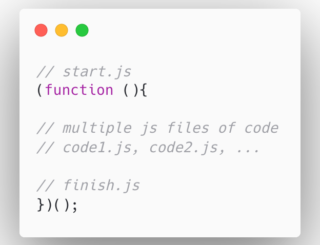

<!-- .slide: data-background="../img/2022/dev-summit/bg-1.png" data-background-size="cover -->
<h1 style="text-align: left; font-size: 80px;">ArcGIS API for JavaScript:</h1>
<h2 style="text-align: left; font-size: 60px;">Building Apps</h2>
<h2 style="text-align: left; font-size: 60px;">with Modern Tooling</h2>

Yannik Messerli | René Rubalcava

<a href="https://twitter.com/yannik_messerli">@yannik_messerli</a>

<a href="https://twitter.com/odoenet">@odoenet</a>

---

<!-- .slide: data-auto-animate data-background="../img/2022/dev-summit/bg-3.png" -->
## Agenda

---

<!-- .slide: data-auto-animate data-background="../img/2022/dev-summit/bg-7.png" -->
# Modern Web Development

---

<!-- .slide: data-auto-animate data-background="../img/2022/dev-summit/bg-2.png" -->
## Modern Web Development

* Long gone are the days of simple make files
* Used to concatenate JS files
* JSMin to minify (maybe)

---

<!-- .slide: data-auto-animate data-background="../img/2022/dev-summit/bg-2.png" -->
## Tooling

* Flexibility
* Plenty of options
  * webpack
  * rollup
  * Parcel
  * Vite
  * esbuild

---

<!-- .slide: data-auto-animate data-background="../img/2022/dev-summit/bg-2.png" -->
## Languages

* JavaScript
* Web Assembly
* TypeScript
* Elm
* Reason

---

<!-- .slide: data-auto-animate data-background="../img/2022/dev-summit/bg-2.png" -->
## Styling

* CSS
* Sass
* CSS Modules
* Flexbox
* CSS Grid
* Houdini

---

<!-- .slide: data-auto-animate data-background="../img/2022/dev-summit/bg-2.png" -->
## Modern Web Development

* CSS
* Sass
* CSS Modules
* Flexbox
* CSS Grid
* Houdini

---

<!-- .slide: data-auto-animate data-background="../img/2022/dev-summit/bg-2.png" -->
### **Where can I get more info?**

- SDK Documentation
- Esri-related training and webinars
- ArcGIS Blogs
- GeoNet, StackExchange, etc. 
 
<a href="https://www.esri.com/arcgis-blog/products/js-api-arcgis/mapping/using-typescript-with-the-arcgis-api-for-javascript/" target="_blank">

---

<!-- .slide: data-auto-animate data-background="../img/2022/dev-summit/bg-5.png" -->

---

<!-- .slide: data-auto-animate data-background="../img/2022/dev-summit/2021-feedback.jpg" -->