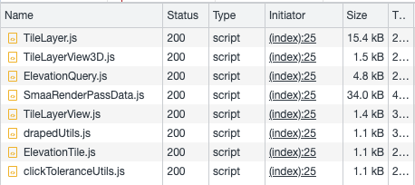
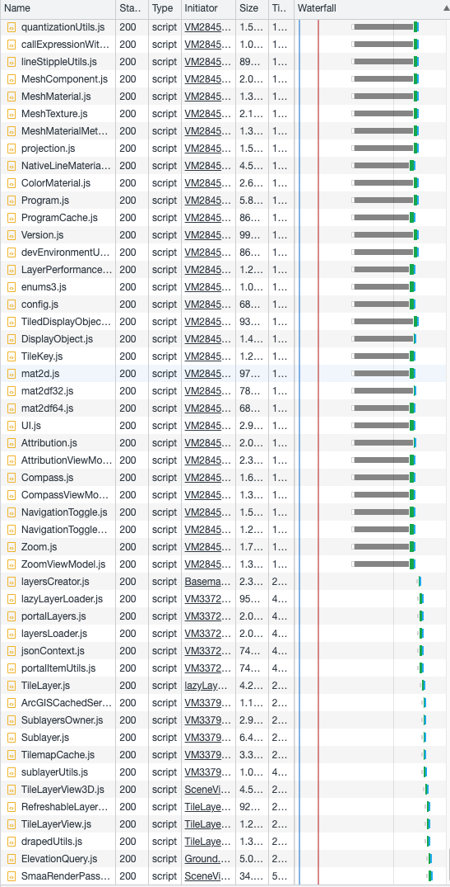
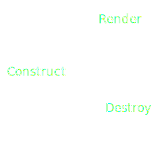
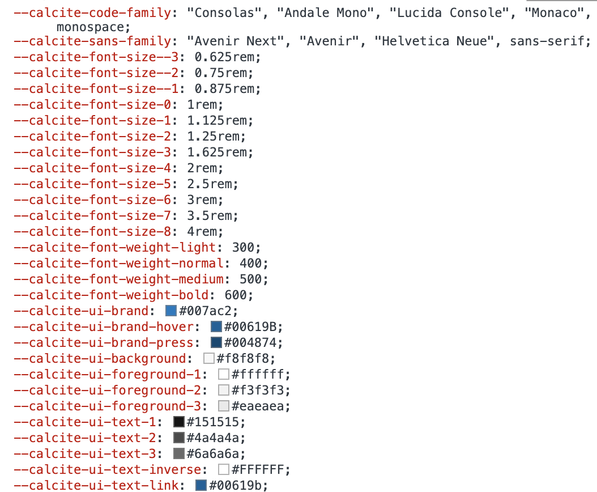
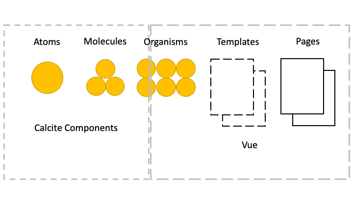
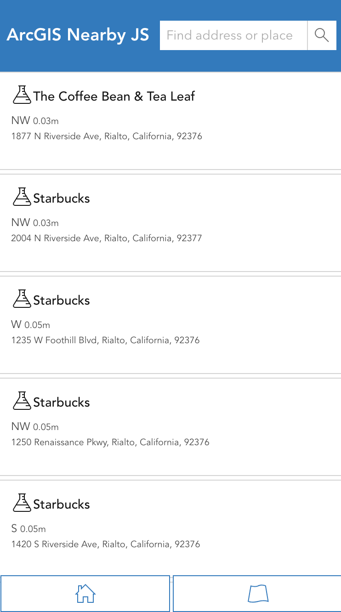
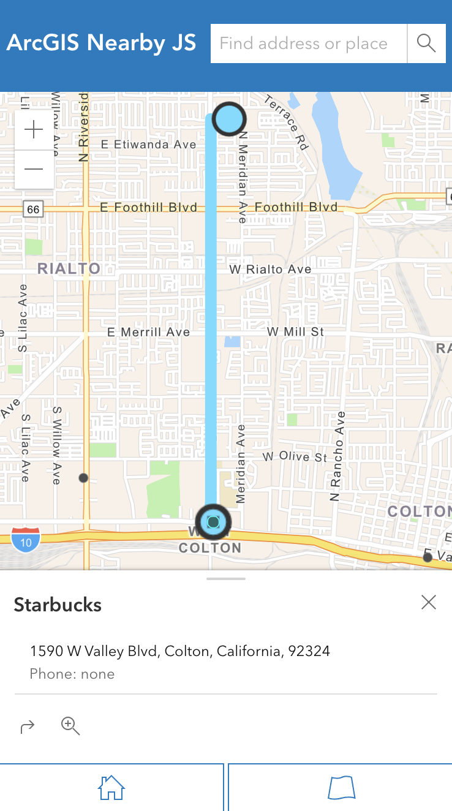

<!-- .slide: data-background="../img/2022/dev-summit/bg-1.png" data-background-size="cover -->
<h1 style="text-align: left; font-size: 80px;">ArcGIS API for JavaScript:</h1>
<h2 style="text-align: left; font-size: 60px;">Building Apps</h2>
<h2 style="text-align: left; font-size: 60px;">with Modern Tooling</h2>
<p style="text-align: left; font-size: 30px;">Yannik Messerli | René Rubalcava</p>
<p style="text-align: left; font-size: 30px;"><a href="https://twitter.com/yannik_messerli">@yannik_messerli</a></p>
<p style="text-align: left; font-size: 30px;"><a href="https://twitter.com/odoenet">@odoenet</a></p>

---

<!-- .slide: data-auto-animate data-background="../img/2022/dev-summit/bg-3.png" -->

## Agenda


---

<!-- .slide: data-auto-animate data-background="../img/2022/dev-summit/bg-5.png" -->

<h2 style="text-align: left; font-size: 80px;">Modern Web</h2>
<h2 style="text-align: left; font-size: 80px;">Development</h2>

---

<!-- .slide: data-auto-animate data-background="../img/2022/dev-summit/bg-2.png" -->

## Modern Web Development: Modules

<div class="two-columns">
  <div class="left-column">

- Long gone are the days of simple make files
- Break down application in meaningful way
- Load only necessary files

  </div>
  <div class="right-column">
  Pure JS:
  <div data-fragment-id="add-widget" class="code-snippet">
      <pre>
        <code class="lang-js" data-trim data-line-numbers>
// start.js
(function () {
  // multiple js files of code
  // code1.js, code2.js, ...
  // finish.js
})();
        </code>
      </pre>
    </div>
    Module (AMD):
    <div data-fragment-id="add-widget" class="code-snippet">
      <pre>
        <code class="lang-js" data-trim data-line-numbers>
// start.js
require(["./code1", "code2"], function (code1, code2) {
  // Use code1 and code2.
});
        </code>
      </pre>
    </div>
  </div>
</div>

---

<!-- .slide: data-auto-animate data-background="../img/2022/dev-summit/bg-2.png" -->

## Simplest example

<div class="two-columns">
  <div class="left-column">
    <div data-fragment-id="add-widget" class="code-snippet">
      <pre>
        <code class="lang-html" data-trim data-line-numbers>
&lt;html&gt;
  &lt;head&gt;
    &lt;link rel=&quot;stylesheet&quot; href=&quot;./main.css&quot; /&gt;
    &lt;script src=&quot;https://js.arcgis.com/4.23/&quot;&gt;&lt;/script&gt;
    &lt;script&gt;
      require([&quot;esri/views/SceneView&quot;], function (SceneView) {
        var view = new SceneView({
          container: &quot;viewDiv&quot;,
          map: {
            basemap: &quot;topo&quot;,
          },
        });
      });
    &lt;/script&gt;
  &lt;/head&gt;
  &lt;body&gt;
    &lt;div id=&quot;viewDiv&quot;&gt;&lt;/div&gt;
  &lt;/body&gt;
&lt;/html&gt;
        </code>
      </pre>
    </div>
  </div>
  <div class="right-column">
    <div class="iframe-wrapper">
      <iframe data-src="./samples/simplest-example.html"></iframe>
    </div>
  </div>
</div>

---

<!-- .slide: data-auto-animate data-background="../img/2022/dev-summit/bg-2.png" -->

## Simplest example



---

<!-- .slide: data-auto-animate data-background="../img/2022/dev-summit/bg-2.png" -->

## ES Modules

<div class="two-columns">
  <div class="left-column">
    <div data-fragment-id="add-widget" class="code-snippet">
      <pre>
        <code class="lang-html" data-trim data-line-numbers>
&lt;script type=&quot;module&quot;&gt;
  import SceneView from 
    &quot;https://jsdev.arcgis.com/4.23/@arcgis/core/views/SceneView.js&quot;;
  var view = new SceneView({
    container: "viewDiv",
    map: {
      basemap: "topo",
    },
  });
&lt;/script&gt;
        </code>
      </pre>
    <div class="fragment">
      
    </div>
    <div class="fragment" style="background: rgba(0,0,0,0.5); color: white;    position: absolute;top: 0;margin-top: 300px;">
      -> We need toolings
    </div>
  </div>

  </div>
  <div class="right-column">
    <div class="iframe-wrapper">
      <iframe data-src="./samples/es-modules.html"></iframe>
    </div>
  </div>
</div>

---

<!-- .slide: data-auto-animate data-background="../img/2022/dev-summit/bg-2.png" -->

## Tooling

- Flexibility
- Plenty of options
  - webpack
  - rollup
  - Parcel
  - Vite
  - esbuild


---

<!-- .slide: data-auto-animate data-background="../img/2022/dev-summit/bg-2.png" -->

## Vite

<div class="two-columns">
  <div class="left-column">
    <div data-fragment-id="add-widget" class="code-snippet">
      <pre>
        <code class="lang-html" data-trim data-line-numbers>
&lt;html&gt;
  &lt;head&gt;
    &lt;link
      rel=&quot;stylesheet&quot;
      href=
      &quot;https://js.arcgis.com/4.23/esri/themes/light/main.css&quot;
    /&gt;
    &lt;link rel=&quot;stylesheet&quot; href=&quot;./src/main.css&quot; /&gt;
    &lt;script type=&quot;module&quot; src=&quot;./src/main.js&quot;&gt;&lt;/script&gt;
  &lt;/head&gt;
  &lt;body&gt;
    &lt;div id=&quot;viewDiv&quot;&gt;&lt;/div&gt;
  &lt;/body&gt;
&lt;/html&gt;
        </code>
      </pre>
    </div>
    <div data-fragment-id="add-widget" class="code-snippet">
      <pre>
        <code class="lang-css" data-trim data-line-numbers>
html,
body,
#viewDiv {
  width: 100%;
  height: 100%;
  margin: 0;
  padding: 0;
}
        </code>
      </pre>
    </div>
  </div>
  <div class="right-column">
    <pre>
      <code class="lang-html" data-trim data-line-numbers>
        mkdir test-vite & cd test-vite
        npm init
        npm install --save @arcgis/core
        npm install --save vite
        npx vite dev
      </code>
    </pre>
    <br/>
     <pre class="fragment">
      <code class="lang-shell" data-trim data-line-numbers>
        npx vite build
      </code>
    </pre>
</div>

---

<!-- .slide: data-auto-animate data-background="../img/2022/dev-summit/bg-2.png" -->

## Webpack

"Simple" Config

```js
module.exports = {
  entry: {
    index: "./src/index.js",
  },
  node: false,
  output: {
    path: path.join(__dirname, "dist"),
    chunkFilename: "chunks/[id].js",
    publicPath: "",
    clean: true,
  },
  module: {
    rules: [
      {
        test: /\.js$/,
        use: {
          loader: "babel-loader",
          options: {
            presets: ["@babel/preset-env"],
          },
        },
      },
      {
        test: /\.css$/,
        use: [MiniCssExtractPlugin.loader, "css-loader"],
      },
    ],
  },
  plugins: [
    new HtmlWebPackPlugin({
      title: "ArcGIS API  for JavaScript",
      template: "./public/index.html",
      filename: "./index.html",
      chunksSortMode: "none",
      inlineSource: ".(css)$",
    }),
    new MiniCssExtractPlugin({
      filename: "[name].[chunkhash].css",
      chunkFilename: "[id].css",
    }),
  ],
};
```

---

<!-- .slide: data-auto-animate data-background="../img/2022/dev-summit/bg-2.png" -->

## Webpack

[`@arcgis/webpack-plugin`](https://github.com/Esri/arcgis-webpack-plugin)

- Useful to copy assets locally
- Can filter unused assets

```js
// webpack.config.js
module.exports = {
  ...
  plugins: [
    new ArcGISPlugin({
      locales: ['en', 'es']
    })
  ]
  ...
}
```

---

<!-- .slide: data-auto-animate data-background="../img/2022/dev-summit/bg-2.png" -->

## Languages

- JavaScript
- TypeScript
- Web Assembly
- Elm
- Reason

---

<!-- .slide: data-auto-animate data-background="../img/2022/dev-summit/bg-2.png" -->

## Typescript

```json
{
  "compilerOptions": {
    "target": "es6"
    "moduleResolution": "Node"
  },
  "include": ["**/*.ts", "src/main.js"],
  "exclude": ["**/node_modules/**"]
}
```

```html
<script type="module" src="src/main.ts"></script>
```

---

<!-- .slide: data-auto-animate data-background="../img/2022/dev-summit/bg-2.png" -->

## Adding some UI elements

<div class="two-columns">
  <div class="left-column">
    <div data-fragment-id="add-widget" class="code-snippet">
      <pre>
        <code class="lang-html" data-trim data-line-numbers>
&lt;div id=&quot;app&quot; class=&quot;esri-widget&quot;&gt;
  &lt;h2&gt;Choose basemap&lt;/h2&gt;
  &lt;select id=&quot;basemap&quot;&gt;
    &lt;option value=&quot;topo-vector&quot;&gt;Topo&lt;/option&gt;
    &lt;option value=&quot;satellite&quot;&gt;Satellite&lt;/option&gt;
    &lt;option value=&quot;oceans&quot;&gt;Oceans&lt;/option&gt;
    &lt;option value=&quot;osm&quot;&gt;Open Street Map&lt;/option&gt;
  &lt;/select&gt;
&lt;/div&gt;
        </code>
      </pre>
    </div>
    <div class="code-snippet fragment">
      <pre>
        <code class="lang-css" data-trim data-line-numbers>
#app {
  padding: 20px;
}
&nbsp;
#app h2 {
  font-size: 15px;
}
&nbsp;
#app select {
  width: 100%;
}
</code>
</pre>
</div>
    <div data-fragment-id="add-widget" class="code-snippet">
      <pre>
        <code class="lang-js" data-trim data-line-numbers>
const select = document.getElementById("select");
select.addEventListener("change", (e) => {
  const target = e.target as HTMLSelectElement;
  view.map = {
    basemap: target.value,
  };
});
</code>
</pre>
</div>
  </div>
  <div class="right-column">
    <iframe src="./samples/ui-example.html" style="height: 500px;"/>    
  </div>
</div>

---

<!-- .slide: data-auto-animate data-background="../img/2022/dev-summit/bg-2.png" -->

## TSX

<div style="clear:both"><pre style="display:inline"><code class="html" style="display:inline">&lt;div&gt&lt;/div&gt</code></pre> -> <pre style="display:inline"><code style="display:inline">tsx("div")</code></pre></div>
<br/>
<div class="two-columns">
  <div class="left-column fragment">
    <div class="code-snippet">
      <pre>
      > MyWidget.ts
        <code class="lang-ts" data-trim data-line-numbers>
@subclass("MyWidget")
class MyWidget extends Widget {
  render() {
    return (
      &lt;div id=&quot;app&quot; class=&quot;esri-widget&quot;&gt;
        ...
      &lt;/div&gt;
    );
  }
}
        </code>
      </pre>
    </div>
    <div class="code-snippet">
      <pre>
      > main.ts
        <code class="lang-ts" data-trim data-line-numbers>
import MyWidget from "./MyWidget.ts";
view.ui.add(new MyWidget(), "top-right");
</code>
</pre>
</div>

  </div>
  <div class="right-column">
    <div class="code-snippet fragment">
      <pre>
      > tsconfig.json
        <code class="lang-json" data-trim data-line-numbers>
{
  "compilerOptions": {
    "target": "es6",
    "experimentalDecorators": true,
    "importHelpers": true,
    "jsx": "react",
    "jsxFactory": "tsx",
    "lib": ["ES2020", "DOM"],
    "moduleResolution": "node",
  },
  "include": ["**/*.ts", "src/main.js"],
  "exclude": ["**/node_modules/**"]
}
        </code>
      </pre>
    </div>
  </div>
</div>

---

<!-- .slide: data-auto-animate data-background="../img/2022/dev-summit/bg-2.png" -->

## Composition

<div>
  
</div>
<br/>
---

<!-- .slide: data-auto-animate data-background="../img/2022/dev-summit/bg-2.png" -->

## Composition

<div class="code-snippet">
  <pre>
  > MyWidget.ts
    <code class="lang-ts" data-trim data-line-numbers>
import BasemapGallery from
  "@arcgis/core/widgets/BasemapGallery";
&nbsp;
@subclass("MyWidget")
class MyWidget extends Widget {
  @property()
  view: SceneView;
&nbsp;
  render() {
    return (
      &lt;BasemapGallery view={this.view} /&gt;
    );
  }
}
</code>

  </pre>
</div>

---

<!-- .slide: data-auto-animate data-background="../img/2022/dev-summit/bg-2.png" -->

## Composition

<div class="code-snippet">
  <pre>
  > MyWidget.ts
    <code class="lang-ts" data-trim data-line-numbers>
import MySecondWidget from "./MySecondWidget";
&nbsp;
@subclass("MyWidget")
class MyWidget extends Widget {
  @property()
  view: SceneView;
&nbsp;
  render() {
    return (
      &lt;MySecondWidget /&gt;
    );
  }
}
</code>
  </pre>
</div>

---

<!-- .slide: data-auto-animate data-background="../img/2022/dev-summit/bg-2.png" -->

## Styling

- Sass
- CSS Modules
- Flexbox
- CSS Grid
- Houdini

---

<!-- .slide: data-auto-animate data-background="../img/2022/dev-summit/bg-2.png" -->

## Sass

<div class="two-columns">
  <div class="left-column">
    <div data-fragment-id="add-widget" class="code-snippet">
      <pre>
        <code class="lang-html" data-trim data-line-numbers>
&lt;link rel=&quot;stylesheet&quot; href=&quot;./src/main.scss&quot; /&gt;
        </code>
      </pre>
    </div>
    <div data-fragment-id="add-widget" class="code-snippet fragment">
      <pre>
        <code class="lang-scss" data-trim data-line-numbers>
#app {
  padding: 20px;
  h2 {
    font-size: 15px;
  }
  select {
    width: 100%;
  }
}
</code>

</pre>
</div>

  </div>
  <div class="right-column">
    <pre>
      <code class="lang-html" data-trim data-line-numbers>
        npm install --save sass
      </code>
    </pre>
  </div>
</div>

---

<!-- .slide: data-auto-animate data-background="../img/2022/dev-summit/bg-2.png" -->

## Sass variables

```sass
$app-padding: 20px;

#app {
  padding: $app-padding;

  h2 {
    font-size: 15px;
  }

  select {
    width: 100%;
  }
}
```

```sass
@import "./variables";

#app {
  padding: $app-padding;
  ...
```

---

<!-- .slide: data-auto-animate data-background="../img/2022/dev-summit/bg-2.png" -->

## Calcite components

<div class="two-columns">
  <div class="left-column">
    <div data-fragment-id="add-widget" class="code-snippet">
      <pre>
        <code class="lang-shell" data-trim data-line-numbers>
npm install --save @esri/calcite-components
        </code>
      </pre>
    </div>
    <div data-fragment-id="add-widget" class="code-snippet fragment">
      > MyWidget.tsx
      <pre>
        <code class="lang-typescript" data-trim data-line-numbers>
import "@esri/calcite-components/dist/components/calcite-select";
import "@esri/calcite-components/dist/components/calcite-option";
...
return (
  &lt;calcite-select id=&quot;basemap&quot;&gt;
    &lt;calcite-option value=&quot;satellite&quot;&gt;Satellite&lt;/calcite-option&gt;
    ...
  &lt;/calcite-select&gt;
);
      </code>
    </pre>
  </div>
  <div data-fragment-id="add-widget" class="code-snippet fragment">
      > main.ts
      <pre>
        <code class="lang-typescript" data-trim data-line-numbers>
import { setAssetPath } from 
  "@esri/calcite-components/dist/components";
// CDN hosted assets
setAssetPath(
"https://unpkg.com/@esri/calcite-components/dist/calcite/assets"
);
      </code>
    </pre>
  </div>

  </div>
  <div class="right-column">
    <iframe src="./samples/calcite-components.html" style="height: 500px;"/>    
  </div>
</div>

---

<!-- .slide: data-auto-animate data-background="../img/2022/dev-summit/bg-2.png" -->

## CSS Variables

<div class="two-columns">
  <div class="left-column">
    <div data-fragment-id="add-widget" class="code-snippet">
      <pre>
        <code class="lang-css" data-trim data-line-numbers>
--calcite-ui-brand: green;
--calcite-ui-text-1: #212020;
--calcite-font-size-0: 1rem;
      </code>
    </pre>
  </div>
  <div data-fragment-id="add-widget" class="code-snippet">
      <pre>
        <code class="lang-css" data-trim data-line-numbers>
#app {
  color: --calcite-ui-text-1;
}
    </pre>
  </div>

  </div>
  <div class="right-column">
    
  </div>
</div>

---

<!-- .slide: data-auto-animate data-background="../img/2022/dev-summit/bg-2.png" -->

## Frameworks

- React
- Vue
- Angular
- Svelte
- Ember
- Solid
- ... and more, and more

---

<!-- .slide: data-auto-animate data-background="../img/2022/dev-summit/bg-2.png" -->

## Vue

- Using Calcite Components?
  - Don't let Vue compile them

```js
compilerOptions: {
  isCustomElement: (tag) => tag.includes('calcite-'),
},
```

---

<!-- .slide: data-auto-animate data-background="../img/2022/dev-summit/bg-2.png" -->

## Vue

- Limitations
- Vue reactivity uses Proxy
  - Don't store ArcGIS instances directly

```js
import { reactive, watchEffect } from "vue";

const data = reactive({ map: webmap, layer: null });

watchEffect(() => {
  if (data.layer) {
    // Errors
    data.map.add(data.layer);
  }
});

// Errors
data.layer = new FeatureLayer(params);
```

---

<!-- .slide: data-auto-animate data-background="../img/2022/dev-summit/bg-2.png" -->

## More...

- Unit Testing
- Web Components
- Monorepos
- Server-Side Rendering
- Progressive Web Apps

---

<!-- .slide: data-auto-animate data-background="../img/2022/dev-summit/bg-2.png" -->

## Why

- Don't get overwhelmed
- Focus on what works for you
- Ignore the noise
- _Your users don't care_

---

<!-- .slide: data-auto-animate data-background="../img/2022/dev-summit/bg-2.png" -->

## Build a more complex app using Vue, Vite, Sass

- Bring it all together to build an app
- Vite - uses esbuild and rollup under the hood
- TypeScript, Vue, Pinia, vue-router
- Calcite Components
- Jest

---

<!-- .slide: data-auto-animate data-background="../img/2022/dev-summit/bg-4.png" -->

<h2 style="text-align: left; font-size: 60px;">Nearby App Demo</h2>
<p style="text-align: left; font-size: 30px;"><a href="https://github.com/odoe/nearby-app">github.com/odoe/nearby-app</a></p>

---

<!-- .slide: data-auto-animate data-background="../img/2022/dev-summit/bg-2.png" -->

## Design



---

<!-- .slide: data-auto-animate data-background="../img/2022/dev-summit/bg-2.png" -->

## Vite Config

```ts
// vite.config.ts
import { defineConfig } from "vite";
import vue from "@vitejs/plugin-vue";
export default defineConfig({
  plugins: [
    vue({
      template: {
        compilerOptions: {
          isCustomElement: (tag) => tag.includes("calcite-"),
        },
      },
    }),
  ],
});
```

---

<!-- .slide: data-auto-animate data-background="../img/2022/dev-summit/bg-2.png" -->

## Routing

- vue-router
  - Lazy load assets

---

<!-- .slide: data-auto-animate data-background="../img/2022/dev-summit/bg-2.png" -->

## Progressive Web App

- Not entirely focused on performance
- Native App experience
- Easy with plugins
  - vite has [vite-plugin-pwa](https://vite-plugin-pwa.netlify.app/)
  - [Google Workbox](https://developers.google.com/web/tools/workbox/) for workers

---

<!-- .slide: data-auto-animate data-background="../img/2022/dev-summit/bg-2.png" -->

## Demo




---

<!-- .slide: data-auto-animate data-background="../img/2022/dev-summit/bg-2.png" -->

### Tips & Tricks

- Authentifcation
- CDN
- Optimisation for 3D (quality mode, OpenGL requirements)

---

<!-- .slide: data-auto-animate data-background="../img/2022/dev-summit/bg-2.png" -->

## Authentication and API Keys

- OAuth
  - Useful if using _private_ content
- API Key
  - Using platform basemaps and/or location services
- Cannot use both together

---

<!-- .slide: data-auto-animate data-background="../img/2022/dev-summit/bg-2.png" -->

## Authentication and API Keys

- Use Environment Variables

```js
// supported in most build tools
config.apiKey = process.env.API_KEY;

// vite uses import.meta
config.apiKey = import.meta.env.VITE_API_KEY;
```

- Please do not commit your keys to git

---

<!-- .slide: data-auto-animate data-background="../img/2022/dev-summit/bg-2.png" -->

## CDN

- Assets/workers loaded via CDN by default
- Can still use AMD CDN for small apps

---

<!-- .slide: data-auto-animate data-background="../img/2022/dev-summit/bg-2.png" -->

### **Where can I get more info?**

- SDK Documentation
- Esri-related training and webinars
- ArcGIS Blogs
- GeoNet, StackExchange, etc.

---

<!-- .slide: data-auto-animate data-background="images/survey.png" -->

---

<!-- .slide: data-auto-animate data-background="../img/2022/dev-summit/bg-8.png" -->
