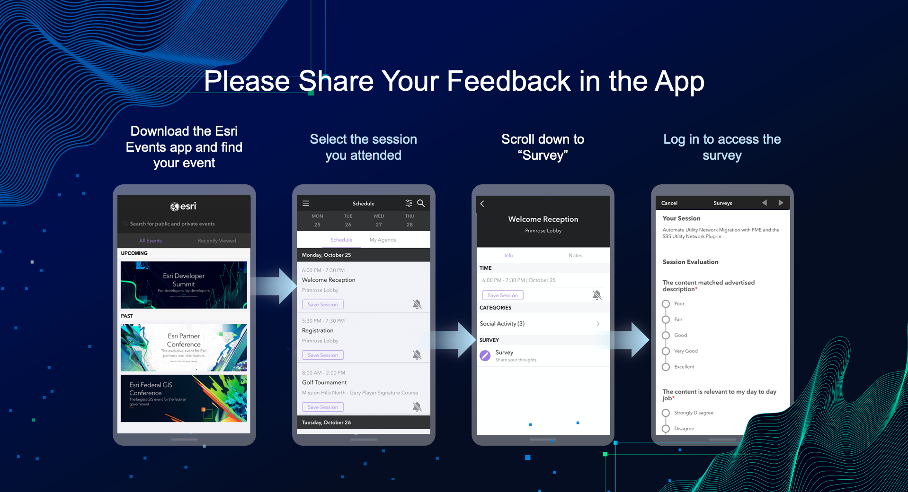

<!-- .slide: data-background="../img/2022/dev-summit/bg-1.png" data-background-size="cover -->
<h1 style="text-align: left; font-size: 80px;">ArcGIS API for JavaScript:</h1>
<h2 style="text-align: left; font-size: 60px;">Building Apps</h2>
<h2 style="text-align: left; font-size: 60px;">with Modern Tooling</h2>
<p style="text-align: left; font-size: 30px;">Yannik Messerli | René Rubalcava</p>
<p style="text-align: left; font-size: 30px;"><a href="https://twitter.com/yannik_messerli">@yannik_messerli</a></p>
<p style="text-align: left; font-size: 30px;"><a href="https://twitter.com/odoenet">@odoenet</a></p>

---

<!-- .slide: data-auto-animate data-background="../img/2022/dev-summit/bg-3.png" -->

## Agenda


---

<!-- .slide: data-auto-animate data-background="../img/2022/dev-summit/bg-5.png" -->

<h2 style="text-align: left; font-size: 80px;">Modern Web</h2>
<h2 style="text-align: left; font-size: 80px;">Development</h2>

---

<!-- .slide: data-auto-animate data-background="../img/2022/dev-summit/bg-2.png" -->

## Modern Web Development: Modules

<div class="two-columns">
  <div class="left-column">

- Long gone are the days of simple make files
- Break down application in meaningful way
- Load only necessary files

  </div>
  <div class="right-column">
  Pure JS:
  <div data-fragment-id="add-widget" class="code-snippet">
      <pre>
        <code class="lang-js" data-trim data-line-numbers>
// start.js
(function () {
  // multiple js files of code
  // code1.js, code2.js, ...
  // finish.js
})();
        </code>
      </pre>
    </div>
    Module (AMD):
    <div data-fragment-id="add-widget" class="code-snippet">
      <pre>
        <code class="lang-js" data-trim data-line-numbers>
// start.js
require(["./code1", "code2"], function (code1, code2) {
  // Use code1 and code2.
});
        </code>
      </pre>
    </div>
  </div>
</div>

---

<!-- .slide: data-auto-animate data-background="../img/2022/dev-summit/bg-2.png" -->

## Simplest example

<div class="two-columns">
  <div class="left-column">
    <div data-fragment-id="add-widget" class="code-snippet">
      <pre>
        <code class="lang-html" data-trim data-line-numbers>
&lt;html&gt;
  &lt;head&gt;
    &lt;link rel=&quot;stylesheet&quot; href=&quot;./main.css&quot; /&gt;
    &lt;script src=&quot;https://js.arcgis.com/4.23/&quot;&gt;&lt;/script&gt;
    &lt;script&gt;
      require([&quot;esri/views/SceneView&quot;], function (SceneView) {
        var view = new SceneView({
          container: &quot;viewDiv&quot;,
          map: {
            basemap: &quot;topo&quot;,
          },
        });
      });
    &lt;/script&gt;
  &lt;/head&gt;
  &lt;body&gt;
    &lt;div id=&quot;viewDiv&quot;&gt;&lt;/div&gt;
  &lt;/body&gt;
&lt;/html&gt;
        </code>
      </pre>
    </div>
  </div>
  <div class="right-column">
    <div class="iframe-wrapper">
      <iframe data-src="./samples/simplest-example.html"></iframe>
    </div>
  </div>
</div>

---

<!-- .slide: data-auto-animate data-background="../img/2022/dev-summit/bg-2.png" -->

## Simplest example


---

<!-- .slide: data-auto-animate data-background="../img/2022/dev-summit/bg-2.png" -->

## ES Modules

<div class="two-columns">
  <div class="left-column">
    <div data-fragment-id="add-widget" class="code-snippet">
      <pre>
        <code class="lang-html" data-trim data-line-numbers>
&lt;script type=&quot;module&quot;&gt;
  import SceneView from 
    &quot;https://jsdev.arcgis.com/4.23/@arcgis/core/views/SceneView.js&quot;;
  var view = new SceneView({
    container: "viewDiv",
    map: {
      basemap: "topo",
    },
  });
&lt;/script&gt;
        </code>
      </pre>
    <div class="fragment">
      
    </div>
    <div class="fragment" style="background: rgba(0,0,0,0.5); color: white;    position: absolute;top: 0;margin-top: 300px;">
      -> We need toolings
    </div>
  </div>

  </div>
  <div class="right-column">
    <div class="iframe-wrapper">
      <iframe data-src="./samples/es-modules.html"></iframe>
    </div>
  </div>
</div>

---

<!-- .slide: data-auto-animate data-background="../img/2022/dev-summit/bg-2.png" -->

## Tooling

- Flexibility
- Plenty of options
  - webpack
  - rollup
  - Parcel
  - Vite
  - esbuild


---

<!-- .slide: data-auto-animate data-background="../img/2022/dev-summit/bg-2.png" -->

## Languages

- JavaScript
- Web Assembly
- TypeScript
- Elm
- Reason

---

<!-- .slide: data-auto-animate data-background="../img/2022/dev-summit/bg-2.png" -->

## Styling

- CSS
- Sass
- CSS Modules
- Flexbox
- CSS Grid
- Houdini

---

<!-- .slide: data-auto-animate data-background="../img/2022/dev-summit/bg-2.png" -->

## Frameworks

- React
- Vue
- Angular
- Svelte
- Ember
- Solid
- ... and more, and more

---

<!-- .slide: data-auto-animate data-background="../img/2022/dev-summit/bg-2.png" -->

## More

- Unit Testing
- Web Components
- Monorepos
- Server-Side Rendering
- Progressive Web Apps

---

<!-- .slide: data-auto-animate data-background="../img/2022/dev-summit/bg-2.png" -->

## Why

- Don't get overwhelmed
- Focus on what works for you
- Ignore the noise
- _Your users don't care_

---

<!-- .slide: data-auto-animate data-background="../img/2022/dev-summit/bg-2.png" -->

## Build an app

- Bring it all together to build an app
- Vite - uses esbuild and rollup under the hood
- TypeScript, Vue, Pinia, vue-router
- Calcite Components
- Jest

---

<!-- .slide: data-auto-animate data-background="../img/2022/dev-summit/bg-4.png" -->

<h2 style="text-align: left; font-size: 60px;">Nearby App Demo</h2>
<p style="text-align: left; font-size: 30px;"><a href="https://github.com/odoe/nearby-app">github.com/odoe/nearby-app</a></p>

---

<!-- .slide: data-auto-animate data-background="../img/2022/dev-summit/bg-2.png" -->

## Design


---

<!-- .slide: data-auto-animate data-background="../img/2022/dev-summit/bg-2.png" -->

## Vite Config

```ts
// vite.config.ts
import { defineConfig } from "vite";
import vue from "@vitejs/plugin-vue";
export default defineConfig({
  plugins: [
    vue({
      template: {
        compilerOptions: {
          isCustomElement: (tag) => tag.includes("calcite-"),
        },
      },
    }),
  ],
});
```

---

<!-- .slide: data-auto-animate data-background="../img/2022/dev-summit/bg-2.png" -->

## Routing

- vue-router
  - Lazy load assets

---

<!-- .slide: data-auto-animate data-background="../img/2022/dev-summit/bg-2.png" -->

## Progressive Web App

- Not entirely focused on performance
- Native App experience
- Easy with plugins
  - vite has [vite-plugin-pwa](https://vite-plugin-pwa.netlify.app/)
  - [Google Workbox](https://developers.google.com/web/tools/workbox/) for workers

---

<!-- .slide: data-auto-animate data-background="../img/2022/dev-summit/bg-2.png" -->

## Authentication and API Keys

- OAuth
  - Useful if using _private_ content
- API Key
  - Using platform basemaps and/or location services
- Cannot use both together

---

<!-- .slide: data-auto-animate data-background="../img/2022/dev-summit/bg-2.png" -->

## Authentication and API Keys

- Use Environment Variables

```js
// supported in most build tools
config.apiKey = process.env.API_KEY;

// vite uses import.meta
config.apiKey = import.meta.env.VITE_API_KEY;
```

- Please do not commit your keys to git

---

<!-- .slide: data-auto-animate data-background="../img/2022/dev-summit/bg-2.png" -->

## Demo


---

<!-- .slide: data-auto-animate data-background="../img/2022/dev-summit/bg-2.png" -->

### **Where can I get more info?**

- SDK Documentation
- Esri-related training and webinars
- ArcGIS Blogs
- GeoNet, StackExchange, etc.

---

<!-- .slide: data-auto-animate data-background="../img/2022/dev-summit/bg-3.png" -->



---
