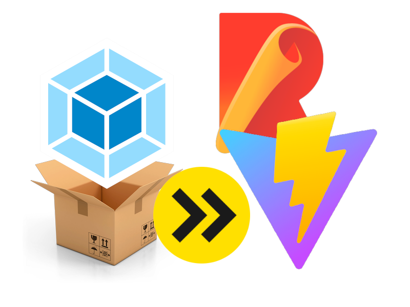

<!-- .slide: data-background="../img/2022/dev-summit/bg-1.png" data-background-size="cover -->
<h1 style="text-align: left; font-size: 80px;">ArcGIS API for JavaScript:</h1>
<h2 style="text-align: left; font-size: 60px;">Building Apps</h2>
<h2 style="text-align: left; font-size: 60px;">with Modern Tooling</h2>
<p style="text-align: left; font-size: 30px;">Yannik Messerli | René Rubalcava</p>
<p style="text-align: left; font-size: 30px;"><a href="https://twitter.com/yannik_messerli">@yannik_messerli</a></p>
<p style="text-align: left; font-size: 30px;"><a href="https://twitter.com/odoenet">@odoenet</a></p>

---

<!-- .slide: data-auto-animate data-background="../img/2022/dev-summit/bg-3.png" -->
## Agenda


---

<!-- .slide: data-auto-animate data-background="../img/2022/dev-summit/bg-5.png" -->

<h2 style="text-align: left; font-size: 80px;">Modern Web</h2>
<h2 style="text-align: left; font-size: 80px;">Development</h2>

---

<!-- .slide: data-auto-animate data-background="../img/2022/dev-summit/bg-2.png" -->
## Modern Web Development

* Long gone are the days of simple make files
* Used to concatenate JS files
* JSMin to minify (maybe)

```js
// start.js
(function (){

// multiple js files of code
// code1.js, code2.js, ...

// finish.js
})();
```

---

<!-- .slide: data-auto-animate data-background="../img/2022/dev-summit/bg-2.png" -->
## Tooling

* Flexibility
* Plenty of options
  * webpack
  * rollup
  * Parcel
  * Vite
  * esbuild



---

<!-- .slide: data-auto-animate data-background="../img/2022/dev-summit/bg-2.png" -->
## Languages

* JavaScript
* Web Assembly
* TypeScript
* Elm
* Reason

---

<!-- .slide: data-auto-animate data-background="../img/2022/dev-summit/bg-2.png" -->
## Styling

* CSS
* Sass
* CSS Modules
* Flexbox
* CSS Grid
* Houdini

---

<!-- .slide: data-auto-animate data-background="../img/2022/dev-summit/bg-2.png" -->
## Frameworks

* React
* Vue
* Angular
* Svelte
* Ember
* Solid
* ... and more, and more

---

<!-- .slide: data-auto-animate data-background="../img/2022/dev-summit/bg-2.png" -->
## More

* Unit Testing
* Web Components
* Monorepos
* Server-Side Rendering
* Progressive Web Apps

---

<!-- .slide: data-auto-animate data-background="../img/2022/dev-summit/bg-2.png" -->
## Why

* Don't get overwhelmed
* Focus on what works for you
* Ignore the noise
* Your users don't care

---

<!-- .slide: data-auto-animate data-background="../img/2022/dev-summit/bg-2.png" -->
## Build an app

* Bring it all together to build an app
* Vite - uses esbuild and rollup under the hood
* TypeScript, Vue, Pinia, vue-router
* Calcite Components
* Jest

---

<!-- .slide: data-auto-animate data-background="../img/2022/dev-summit/bg-4.png" -->

<h2 style="text-align: left; font-size: 60px;">Nearby App Demo</h2>
<p style="text-align: left; font-size: 30px;"><a href="https://github.com/odoe/nearby-app">github.com/odoe/nearby-app</a></p>

---

<!-- .slide: data-auto-animate data-background="../img/2022/dev-summit/bg-2.png" -->
## Design


---

<!-- .slide: data-auto-animate data-background="../img/2022/dev-summit/bg-2.png" -->
## Vite Config

```ts
// vite.config.ts
import { defineConfig } from 'vite'
import vue from '@vitejs/plugin-vue'
export default defineConfig({
  plugins: [
    vue({
      template: {
        compilerOptions: {
          isCustomElement: (tag) => tag.includes('calcite-'),
        },
      },
    }),
  ],
})
```

---

<!-- .slide: data-auto-animate data-background="../img/2022/dev-summit/bg-2.png" -->

## Routing

* vue-router
  * Lazy load assets

---

<!-- .slide: data-auto-animate data-background="../img/2022/dev-summit/bg-2.png" -->

## Progressive Web App

* Not entirely focused on performance
* Native App experience
* Easy with plugins
  - vite has [vite-plugin-pwa](https://vite-plugin-pwa.netlify.app/)
  - [Google Workbox](https://developers.google.com/web/tools/workbox/) for workers

---

<!-- .slide: data-auto-animate data-background="../img/2022/dev-summit/bg-2.png" -->

## Authentication and API Keys

* OAuth
  - Useful if using _private_ content
* API Key
  - Using platform basemaps and/or location services
* Cannot use both together

---

<!-- .slide: data-auto-animate data-background="../img/2022/dev-summit/bg-2.png" -->

## Authentication and API Keys

* Use Environment Variables

```js
// supported in most build tools
config.apiKey = process.env.API_KEY

// vite uses import.meta
config.apiKey = import.meta.env.VITE_API_KEY
```

* Please do not check in keys to git

---

<!-- .slide: data-auto-animate data-background="../img/2022/dev-summit/bg-2.png" -->

## Demo


---

<!-- .slide: data-auto-animate data-background="../img/2022/dev-summit/bg-2.png" -->
### **Where can I get more info?**

- SDK Documentation
- Esri-related training and webinars
- ArcGIS Blogs
- GeoNet, StackExchange, etc.

---

<!-- .slide: data-auto-animate data-background="../img/2022/dev-summit/bg-8.png" -->

---

<!-- .slide: data-auto-animate data-background="../img/2022/dev-summit/2021-feedback.jpg" -->