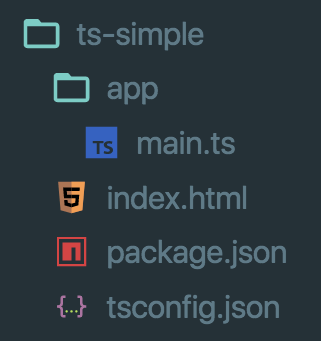

<!-- .slide: data-background="../img/2022/dev-summit/bg-1.png" data-background-size="cover -->
<h1 style="text-align: left; font-size: 80px;">Using TypeScript</h1>
<h2 style="text-align: left; font-size: 60px;">with the ArcGIS API for JavaScript</h2>
<p style="text-align: left; font-size: 30px;">Noah Sageri</p>
<p style="text-align: left; font-size: 30px;">René Rubalcava</p>
<p style="text-align: left; font-size: 30px;"><a href="https://twitter.com/odoenet">@odoenet</a></p>

---

<!-- .slide: data-auto-animate data-background="../img/2022/dev-summit/bg-2.png" -->
## **Developer Setup**

<a href="https://developers.arcgis.com/javascript/latest/guide/typescript-setup/index.html" target="_blank">

</a>

---

<!-- .slide: data-auto-animate data-background="../img/2022/dev-summit/bg-2.png" -->
## **Developer Setup**

<a href="https://developers.arcgis.com/javascript/latest/guide/typescript-setup/index.html" target="_blank">

</a>

---

<!-- .slide: data-auto-animate data-background="../img/2022/dev-summit/bg-2.png" -->
## Setup and First steps

1. The recommended way to install TypeScript is via `node` and `npm`.

2. Make sure to install TypeScript globally: <br>
```bash
npm install -g typescript
```
3. Install the ArcGIS API for JavaScript: <br>
```bash
npm install --save @arcgis/core
```

---

<!-- .slide: data-auto-animate data-background="../img/2022/dev-summit/bg-2.png" -->
## Imports

```ts
import MapView from "@arcgis/core/views/MapView";
```

---

<!-- .slide: data-auto-animate data-background="../img/2022/dev-summit/bg-2.png" -->
## Auto-cast

- Due to nature of types, auto-cast does not type-check
  - `get` and `set` must have the same type
- Auto-casting is supported in constructor signatures only
  - Still helps in lots of cases
  - For setting properties, need to import the relevant modules

---

<!-- .slide: data-auto-animate data-background="../img/2022/dev-summit/bg-2.png" -->
## Typing improvements

- Use of generics where possible `Collection<T>`
- Strictly type events (`mapView.on("mouse-wheel", ...)`))
- "Advanced" auto-casts like colors (`"red"`), screen sizes (`"5px"`) and basemaps `"streets"`

---

<!-- .slide: data-auto-animate data-background="../img/2022/dev-summit/bg-2.png" -->
## Demo Steps:

```sh
mkdir ts-demo && cd ts-demo
mkdir src && touch src/index.ts
npm init --yes && tsc --init
npm i @arcgis/core
```

---

<!-- .slide: data-auto-animate data-background="../img/2022/dev-summit/bg-2.png" -->
## index.html

```html
<body>
  <div id="viewDiv"></div>
  <script src="src/index.js" type="module"></script>
</body>
```

---

<!-- .slide: data-auto-animate data-background="../img/2022/dev-summit/bg-2.png" -->
## tsconfig.json

```json
{
  "compilerOptions": {
    "target": "esnext",
    "module": "esnext",
    "lib": ["esnext", "dom"],
    "moduleResolution": "node",
    "strict": true,
    "sourceMap": true,
    "noEmit": true,
  },
  "include": ["./src"]
}
```

---

<!-- .slide: data-auto-animate data-background="../img/2022/dev-summit/bg-2.png" -->
## css

```css
@import url("https://js.arcgis.com/4.20/esri/themes/light/main.css");

html,
body,
#viewDiv {
  padding: 0;
  margin: 0;
  height: 100%;
  width: 100%;
}
```

---

<!-- .slide: data-auto-animate data-background="../img/2022/dev-summit/bg-2.png" -->
## src/index.ts

> imports

```ts
import WebMap from "@arcgis/core/WebMap";
import MapView from "@arcgis/core/views/MapView";
import LayerList from "@arcgis/core/widgets/LayerList";

```

---

<!-- .slide: data-auto-animate data-background="../img/2022/dev-summit/bg-2.png" -->
## src/index.ts

> WebMap and MapView

```ts
const map = new WebMap({
  portalItem: {
    id: 'd5dda743788a4b0688fe48f43ae7beb9'
  }
});

// Add the map to a MapView
const view = new MapView({
  container: 'viewDiv',
  map
});
```

---

<!-- .slide: data-auto-animate data-background="../img/2022/dev-summit/bg-2.png" -->
## src/index.ts

> LayerList

```ts
// Add a legend instance to the panel of a
// ListItem in a LayerList instance
const layerList = new LayerList({
  view,
  listItemCreatedFunction: (event: { item: __esri.ListItem }) => {
    const item = event.item;
    if (item.layer.type != 'group') {
      item.panel = {
        content: 'legend',
        open: true
      } as __esri.ListItemPanel;
    }
  }
});
view.ui.add(layerList, 'top-right');
```

---

<!-- .slide: data-auto-animate data-background="../img/2022/dev-summit/bg-2.png" -->
> Demo

---

<!-- .slide: data-auto-animate data-background="../img/2022/dev-summit/bg-2.png" -->
### **Where can I get more info?**

- SDK Documentation
- Esri-related training and webinars
- ArcGIS Blogs
- GeoNet, StackExchange, etc.</br>
</br>
<a href="https://www.esri.com/arcgis-blog/products/js-api-arcgis/mapping/using-typescript-with-the-arcgis-api-for-javascript/" target="_blank">


---

<!-- .slide: data-auto-animate data-background="../img/2022/dev-summit/bg-5.png" -->


---

<!-- .slide: data-auto-animate data-background="../img/2022/dev-summit/2021-feedback.jpg" -->
