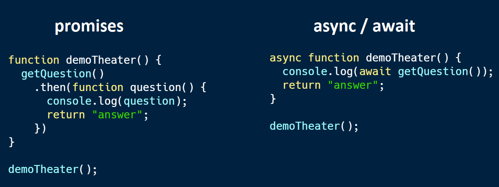

<!-- .slide: data-background="../img/2022/dev-summit/bg-1.png" data-background-size="cover -->
<h1 style="text-align: left; font-size: 80px;">Using TypeScript</h1>
<h2 style="text-align: left; font-size: 60px;">with the ArcGIS API for JavaScript</h2>
<p style="text-align: left; font-size: 30px;">Noah Sager</p>
<p style="text-align: left; font-size: 30px;"><a href="https://twitter.com/noashx">@noashx</a></p>
<p style="text-align: left; font-size: 30px;">René Rubalcava</p>
<p style="text-align: left; font-size: 30px;"><a href="https://twitter.com/odoenet">@odoenet</a></p>

---

<!-- .slide: data-auto-animate data-background="../img/2022/dev-summit/bg-2.png" -->
## Agenda
</br>

 - What is TypeScript?
 - Why use TypeScript?
 - Setup and first steps
 - Tips and tricks
 - Live demo
 - Where can I get more info?

---

<!-- .slide: data-auto-animate data-background="../img/2022/dev-summit/bg-2.png" -->
## What is TypeScript?

<a href="https://www.typescriptlang.org/" target="_blank">

</a>

---

<!-- .slide: data-auto-animate data-background="../img/2022/dev-summit/bg-2.png" -->
## Where do I begin?
</br>

<a href="https://www.typescriptlang.org/" target="_blank">

</a>

---

<!-- .slide: data-auto-animate data-background="../img/2022/dev-summit/bg-2.png" -->
## **Developer Setup**

<a href="https://developers.arcgis.com/javascript/latest/guide/typescript-setup/index.html" target="_blank">

</a>

---

<!-- .slide: data-auto-animate data-background="../img/2022/dev-summit/bg-2.png" -->
## Benefits of TypeScript
</br>

- Easier to test
- Easier to refactor
- Easier for multiple people to work on
- Can help prevent technical debt

---

<!-- .slide: data-auto-animate data-background="../img/2022/dev-summit/bg-2.png" -->
## Why use TypeScript?
</br>
TypeScript adds *type* support to JavaScript
</br>
</br>


---

<!-- .slide: data-auto-animate data-background="../img/2022/dev-summit/bg-2.png" -->
## Why use TypeScript?
</br>
Enhanced IDE support
</br>


---

<!-- .slide: data-auto-animate data-background="../img/2022/dev-summit/bg-2.png" -->
## Why use TypeScript?
</br>
Makes use of the latest JavaScript features
</br>
</br>


---

<!-- .slide: data-auto-animate data-background="../img/2022/dev-summit/bg-2.png" -->
## Why use TypeScript?
</br>
Makes use of the latest JavaScript features
</br>
</br>


---

<!-- .slide: data-auto-animate data-background="../img/2022/dev-summit/bg-2.png" -->
## Setup and First steps

1. The recommended way to install TypeScript is via `node` and `npm`.

2. Make sure to install TypeScript globally: <br>
```bash
npm install -g typescript
```
3. Install the ArcGIS API for JavaScript: <br>
```bash
npm install --save @arcgis/core
```

---

<!-- .slide: data-auto-animate data-background="../img/2022/dev-summit/bg-2.png" -->
#### Tips and live demo


---

<!-- .slide: data-auto-animate data-background="../img/2022/dev-summit/bg-2.png" -->
## Imports
</br>

```ts
import MapView from "@arcgis/core/views/MapView";
```

---

<!-- .slide: data-auto-animate data-background="../img/2022/dev-summit/bg-2.png" -->
## Autocasting
</br>

- Due to nature of types, autocast does not type-check
  - `get` and `set` must have the same type
- Autocasting is supported in constructor signatures only
  - Still helps in lots of cases
  - For setting properties, need to import the relevant modules

---

<!-- .slide: data-auto-animate data-background="../img/2022/dev-summit/bg-2.png" -->
## Typing improvements
</br>

- Use of generics where possible `Collection<T>`
- Strictly type events (`mapView.on("mouse-wheel", ...)`))
- "Advanced" auto-casts like colors (`"red"`), screen sizes (`"5px"`) and basemaps `"streets"`

---

<!-- .slide: data-auto-animate data-background="../img/2022/dev-summit/bg-2.png" -->
## Demo Steps:

I just use Vite

```sh
npm create vite@latest
cd ts-demo
npm i @arcgis/core
```

---

<!-- .slide: data-auto-animate data-background="../img/2022/dev-summit/bg-2.png" -->
## index.html
</br>

```html
<body>
  <div id="viewDiv"></div>
  <script type="module" src="/src/main.ts"></script>
</body>
```

---

<!-- .slide: data-auto-animate data-background="../img/2022/dev-summit/bg-2.png" -->
## tsconfig.json

Barebones config

```json
{
  "compilerOptions": {
    "target": "esnext",
    "module": "esnext",
    "lib": ["esnext", "dom"],
    "moduleResolution": "node",
    "strict": true,
    "sourceMap": true,
    "noEmit": true,
  },
  "include": ["./src"]
}
```

---

<!-- .slide: data-auto-animate data-background="../img/2022/dev-summit/bg-2.png" -->
## css

```css
@import url("https://js.arcgis.com/4.22/esri/themes/light/main.css");

html,
body,
#viewDiv {
  padding: 0;
  margin: 0;
  width: 100%;
  height: 100%;
}
```

---

<!-- .slide: data-auto-animate data-background="../img/2022/dev-summit/bg-2.png" -->
## src/app.ts

> imports

```ts
import Accessor from '@arcgis/core/core/Accessor';
import Collection from '@arcgis/core/core/Collection';
import config from '@arcgis/core/config';
import ArcGISMap from '@arcgis/core/Map';
import FeatureLayer from '@arcgis/core/layers/FeatureLayer';
import MapView from '@arcgis/core/views/MapView';
import FeatureLayerView from '@arcgis/core/views/layers/FeatureLayerView';
import { whenOnce } from '@arcgis/core/core/watchUtils';
import SimpleRenderer from '@arcgis/core/renderers/SimpleRenderer';
import SimpleMarkerSymbol from '@arcgis/core/symbols/SimpleMarkerSymbol';
import SizeVariable from '@arcgis/core/renderers/visualVariables/SizeVariable';
import { subclass, property } from '@arcgis/core/core/accessorSupport/decorators';
```

---

<!-- .slide: data-auto-animate data-background="../img/2022/dev-summit/bg-2.png" -->
## src/main.ts

> Map and MapView

```ts
import './style.css'
import App from './app';

const apiKey = import.meta.env.VITE_API_KEY as string;
const app = new App({ apiKey });

app.watch('loaded', () => {
  console.log('app is loaded')
})

app.layerViews.on('after-add', (event) => {
  console.log(event.item);
});
```

---

<!-- .slide: data-auto-animate data-background="../img/2022/dev-summit/bg-4.png" -->

<h2 style="text-align: left; font-size: 60px;">TypeScript App</h2>
<h2 style="text-align: left; font-size: 60px;">Demo</h2>
<p style="text-align: left; font-size: 30px;"><a href="https://github.com/odoe/arcgis-ts-demo">github.com/odoe/arcgis-ts-demo</a></p>

---

<!-- .slide: data-auto-animate data-background="../img/2022/dev-summit/bg-2.png" -->
### **Where can I get more info?**

- SDK Documentation
- Esri-related training and webinars
- ArcGIS Blogs
- Esri Community, StackExchange, etc.</br>
</br>
<a href="https://www.esri.com/arcgis-blog/products/js-api-arcgis/mapping/using-typescript-with-the-arcgis-api-for-javascript/" target="_blank">


---

<!-- .slide: data-auto-animate data-background="../img/2022/dev-summit/bg-3.png" -->


---

<!-- .slide: data-auto-animate data-background="../img/2022/dev-summit/bg-5.png" -->


---

<!-- .slide: data-auto-animate data-background="../img/2022/dev-summit/2021-feedback.jpg" -->
